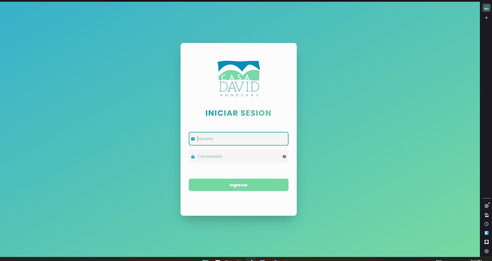
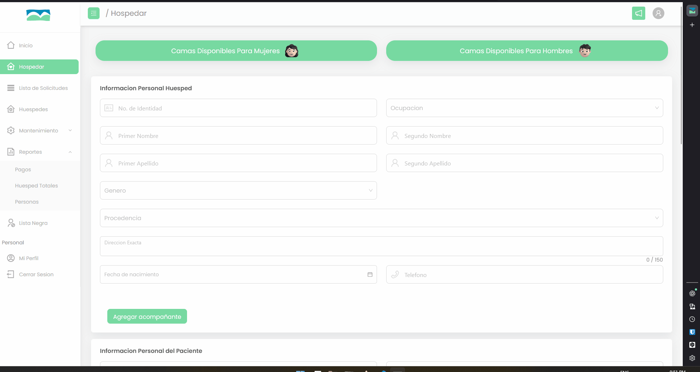
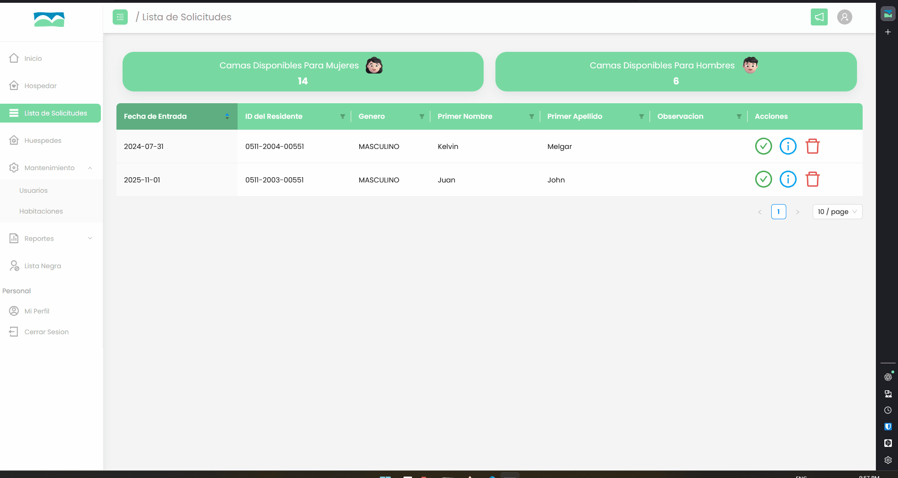

# 🏠 Casa David Web Platform

## 📖 Overview
This project was developed as a **volunteer initiative** for [Casa David Honduras](https://casadavid.org/), a nonprofit organization that provides **temporary housing and support to families of hospitalized patients** in Honduras.

The platform enables the organization to **digitally manage guests, rooms, and daily operations**, improving efficiency and record-keeping for administrators and volunteers.

## 💡 Main Features

- 🔐 **User Authentication & Role Management** 

- 🏨 **Guest & Room Registration**  

- 📝 **Check-in / Check-out Tracking**  

- 💾 **Data Persistence with PostgreSQL**  

- 🌐 **Responsive & Accessible UI (Ant Design)**

- ☁️ **Cloud Deployment on Heroku**  

## ⚙️ Technologies Used
**Frontend:** React, Ant Design  
**Backend:** Node.js, Express  
**ORM:** Sequelize  
**Database:** PostgreSQL  
**Hosting:** Heroku  
**Version Control:** Git & GitHub  

## 🖼️ Demo
### Web Admin Dashboard
A look at the **administrator's web interface** for requesting accomodation, managing bookings, assigning beds, and generating reports.

| Login Page | 
| :---: | 
|  |

| Requesting Accommodation |
| :---: |
|  |

| Assigning a Bed | 
| :---: |
|  | 

| Managing Guests |
| :---: |
|  |


## 🌟 Project Team


All members contributed as **Full-Stack Developers**, collaborating on frontend, backend, and database integration.

- Ana Rivera  
- Lia Ramirez  
- Valeria Alfaro  
- Alex Roberto  
- Alejandro Orellana  
- Cristian Martinez  
- Daniel Dubon  
- Edgar Romero  
- Fabrizio Ramos  
- Kelvin Melgar  
- Juan Godoy  
- Nelson Recarte  
- Rene Dubon  

👨🏻‍🏫 Guided by **Ing. Erick Amaya**

---
## 🚀 Installation & Setup
1. Clone the repository:
   ```bash
   git clone https://github.com/LiaF21/UX_Backend.git
   cd UX_backend
2. Install dependencies of the server:
   ```bash
   cd ./server
   npm install
   

3. Install dependencies of the client:
   ```bash
   cd ../client
   npm install

4. Configure your .env file:
   ```bash
   DB_HOST=your_database_host
   DB_USER=your_username
   DB_PASS=your_password
   DB_NAME=your_database_name
   PORT=3003 // You need to define the same port variable at the .env on the client

5. Restore database from de file (data to testing)
   ```bash
   ./UX_Backend/server/CasaDavid.sql
7. If you are develping o testing features you're going to need run the server and the client at the same time.
- In the server folder exect
     npm run dev
- In the client folder exect
      npm run start-client


## 📜 License

This project was developed voluntarily for Casa David Honduras and is intended for nonprofit use only.
